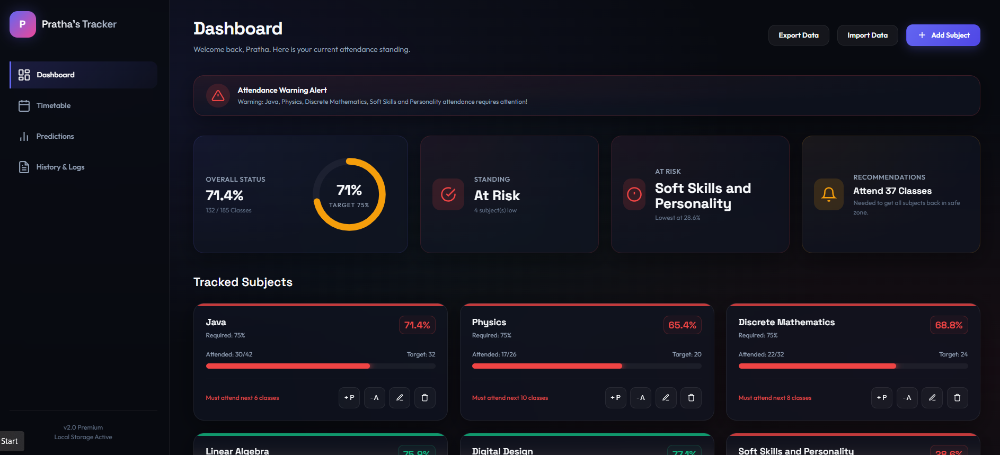
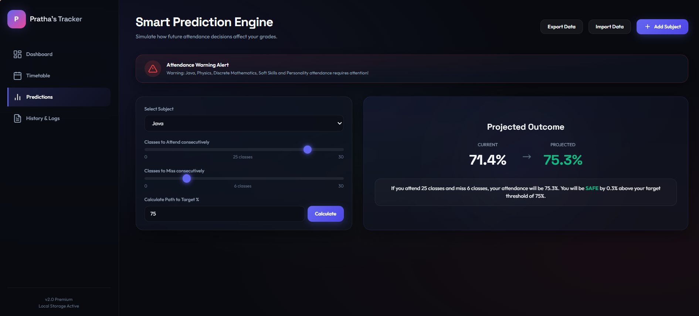
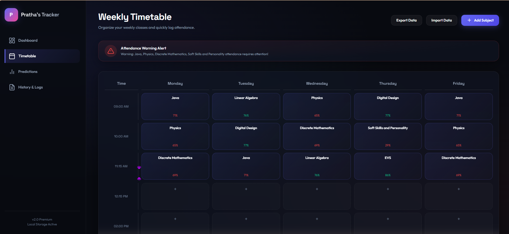

# Attendance Management & Prediction System

A web-based attendance management application designed to help students track attendance, manage timetables, and predict future attendance requirements.

## Features

- Subject-wise attendance tracking
- Attendance percentage calculation
- Attendance prediction and simulation
- Timetable management
- Calendar-based attendance logging
- Import and export of attendance data
- Performance analytics dashboard
- Risk alerts and recommendations

## Tech Stack

- HTML
- CSS
- JavaScript

## Future Improvements

- User authentication
- Cloud database integration
- Mobile responsiveness
- Attendance reports and statistics

## Screenshots

### Dashboard

### Attendance Predictions

### Timetable Management

### History & Logs

